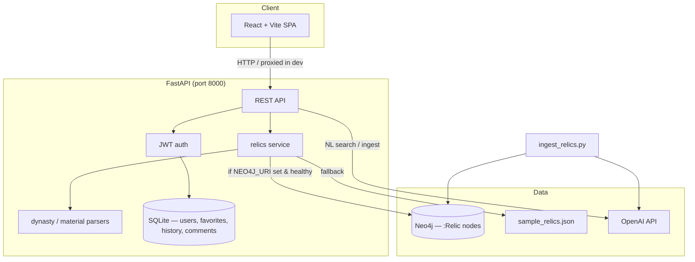

# Overseas Relic Knowledge Platform

[](LICENSE)

A full-stack web platform for exploring **Chinese heritage relics held in overseas museums**. Browse a faceted catalog, inspect rich metadata, compare objects side by side, and engage with community features—backed by an optional **Neo4j** knowledge graph, a **JSON fallback** for offline development, and a **SQLite** store for accounts and social data.

---

## Table of contents

- [Overview](#overview)
- [Architecture](#architecture)
- [Tech stack](#tech-stack)
- [Features](#features)
- [Prerequisites](#prerequisites)
- [Installation](#installation)
- [Environment variables](#environment-variables)
- [Running the project](#running-the-project)
- [Data ingestion](#data-ingestion)
- [API reference](#api-reference)
- [Admin panel](#admin-panel)
- [Testing](#testing)
- [Project structure](#project-structure)
- [Deployment notes](#deployment-notes)
- [License & credits](#license--credits)

---

## Overview

Museum open-access APIs and graph databases make it possible to unify scattered records of Chinese art abroad. This project provides:

- A **public catalog** with search, filters, sorting, exports, statistics, and a timeline view.
- **Relic detail pages** with sanitized HTML descriptions, image lightbox, related works, and comments.
- **User accounts** with JWT authentication, favorites, browsing history, and comment likes.
- An **admin panel** for moderating users and comments.
- A **batch ingestion pipeline** that pulls from major museums, filters candidates, verifies relevance with **GPT-4o-mini**, and loads verified records into Neo4j.

When Neo4j is not configured or unreachable, every relic endpoint transparently falls back to `database/graph/sample_relics.json`—ideal for CI, frontend-only work, and quick demos.

---

## Architecture



| Layer | Responsibility |
|--------|----------------|
| **Frontend** | SPA on port **3000**; Vite dev server proxies API paths to the backend. |
| **FastAPI** | Relic catalog, stats, timeline, exports, auth, user features, admin routes. |
| **Neo4j** | Primary store for ingested museum relics (`:Relic` nodes with string properties). |
| **SQLite** | User accounts, favorites, view history, comments, and comment likes. |
| **JSON sample** | Bundled fallback dataset when the graph is off or empty. |
| **ingest_relics.py** | ETL from Met, Cleveland, V&A, and Art Institute APIs → AI verification → Neo4j. |

**Request flow (catalog):** `GET /relics` → try Neo4j page query → on failure or empty graph, filter/sort/paginate `sample_relics.json` with the same facet and ranking semantics.

---

## Tech stack

| Layer | Technologies |
|--------|----------------|
| **Backend** | Python 3.11+, [FastAPI](https://fastapi.tiangolo.com/), [Uvicorn](https://www.uvicorn.org/), [SQLAlchemy](https://www.sqlalchemy.org/), [Neo4j Python driver](https://neo4j.com/docs/python-manual/current/), [python-jose](https://python-jose.readthedocs.io/) (JWT), [passlib](https://passlib.readthedocs.io/) (bcrypt), [OpenAI SDK](https://github.com/openai/openai-python), [openpyxl](https://openpyxl.readthedocs.io/) |
| **Frontend** | [React 18](https://react.dev/), [TypeScript](https://www.typescriptlang.org/), [Vite 6](https://vite.dev/), [React Router 7](https://reactrouter.com/), [Tailwind CSS 4](https://tailwindcss.com/), [Radix UI](https://www.radix-ui.com/), [i18next](https://www.i18next.com/) (EN / AZ / ZH), [Leaflet](https://leafletjs.com/), [Recharts](https://recharts.org/) |
| **Graph DB** | [Neo4j 5.x](https://neo4j.com/) (Docker recommended) |
| **Ingestion** | `requests`, `neo4j`, `python-dotenv`, OpenAI `gpt-4o-mini` |
| **Testing** | [pytest](https://docs.pytest.org/), [httpx](https://www.python-httpx.org/) TestClient |

---

## Features

### Catalog & discovery

- Paginated catalog with **dynasty**, **material**, and **museum** facets (options respect cross-filters).
- Full-text **search** with relevance ranking (exact title → partial title → other fields).
- **Advanced search** (name, museum, dynasty, material, date range, artist, classification).
- **Natural-language search** (`POST /relics/query/natural`) — GPT-4o-mini parses the query into structured filters.
- Grid / list views; shareable URL query strings.
- **Export** catalog results as CSV, JSON, or styled XLSX (up to 10,000 rows).

### Relic detail & analysis

- Hero image with **lightbox** zoom for HTTP(S) URLs.
- Sanitized HTML descriptions; metadata table; dynamic extra properties from the API.
- **Related relics** (shared dynasty or museum).
- **Compare** up to several relics on a dedicated page.
- Optional **knowledge-graph** visualization component on detail views.

### Statistics & geography

- Collection-wide **stats** (`/stats`): totals and breakdowns by museum, dynasty, material.
- **Timeline** by century from leading date year.
- **Museum map** with geocoded pins and relic counts (`/museums/geo`).

### Accounts & community

- Register / login with **JWT** (7-day token lifetime).
- **Favorites** and **browsing history** (last 50 views).
- **Comments** per relic with likes (cannot like own comments).
- Profile page for managing personal data.

### Admin

- Dashboard metrics (users, favorites, history, comments).
- Ban / unban users; grant / revoke admin (protects last admin).
- Delete users (cascades related data) and moderate comments.

### Internationalization

- UI strings in **English**, **Azerbaijani**, and **Chinese** (`frontend/src/locales/`).

---

## Prerequisites

| Tool | Version (recommended) | Purpose |
|------|------------------------|---------|
| **Python** | 3.11+ | Backend API, ingestion, tests |
| **Node.js** | 20 LTS+ | Frontend build & dev server |
| **npm** | 10+ | Frontend dependencies |
| **Docker** | 24+ (optional) | Neo4j container |
| **Git** | 2.x | Clone the repository |

Optional: **OpenAI API key** for natural-language search and full museum ingestion.

---

## Installation

### 1. Clone the repository

```bash
git clone https://github.com/<your-org>/Relic-system.git
cd Relic-system
```

### 2. Backend

```bash
cd backend
python -m venv venv

# Windows
venv\Scripts\activate

# macOS / Linux
source venv/bin/activate

pip install -r requirements.txt
```

Create `backend/.env` (see [Environment variables](#environment-variables)). For JSON-only mode, you can leave `NEO4J_URI` unset.

### 3. Frontend

```bash
cd ../frontend
npm install
```

### 4. Neo4j with Docker (optional, recommended for production-like data)

```bash
docker run --name neo4j-relics \
  -p 7474:7474 -p 7687:7687 \
  -e NEO4J_AUTH=neo4j/your_secure_password \
  -v neo4j-relics-data:/data \
  -d neo4j:5.11
```

- **Browser UI:** http://localhost:7474  
- **Bolt URI:** `bolt://localhost:7687`

Set `NEO4J_URI`, `NEO4J_USER`, and `NEO4J_PASSWORD` in `backend/.env` to match `NEO4J_AUTH`.

> **Windows shortcut:** `start.bat` at the repo root starts Neo4j (creating a container if needed), then launches backend and frontend in separate terminals. Adjust the Docker volume path inside `start.bat` for your machine.

### 5. Create an admin user (optional)

From `backend/` with the venv active:

```bash
python create_admin.py
```

Default credentials are defined in `create_admin.py`—**change the password immediately** after first login in any shared or production environment.

---

## Environment variables

Create **`backend/.env`** (loaded by `app/core/database.py`, `app/db/database.py`, and `ingest_relics.py`):

| Variable | Required | Default | Description |
|----------|----------|---------|-------------|
| `NEO4J_URI` | No | — | Bolt URI, e.g. `bolt://localhost:7687`. Omit or leave empty for JSON-only mode. |
| `NEO4J_USER` | If Neo4j | `neo4j` | Database username. |
| `NEO4J_PASSWORD` | If Neo4j | `password` | Database password. |
| `OPENAI_API_KEY` | For NL search & ingest | — | OpenAI API key (`gpt-4o-mini`). |
| `SECRET_KEY` | **Yes in production** | dev placeholder | JWT signing secret; use a long random string. |
| `DATABASE_URL` | No | `sqlite:///./relic_users.db` | SQLAlchemy URL for user data (SQLite file created under `backend/`). |

**Example `backend/.env`:**

```env
NEO4J_URI=bolt://localhost:7687
NEO4J_USER=neo4j
NEO4J_PASSWORD=your_secure_password

OPENAI_API_KEY=sk-...

SECRET_KEY=replace-with-a-long-random-secret-in-production
DATABASE_URL=sqlite:///./relic_users.db
```

The frontend does not require environment variables in development; Vite proxies API routes to `http://127.0.0.1:8000`.

---

## Running the project

### Development (two terminals)

**Terminal 1 — API** (from `backend/`, venv active):

```bash
uvicorn app.main:app --reload --host 0.0.0.0 --port 8000
```

- API: http://127.0.0.1:8000  
- Interactive docs: http://127.0.0.1:8000/docs  
- OpenAPI schema: http://127.0.0.1:8000/redoc  

**Terminal 2 — UI** (from `frontend/`):

```bash
npm run dev
```

- App: http://localhost:3000  

`vite.config.ts` proxies `/relics`, `/stats`, `/timeline`, `/museums`, `/health`, `/auth`, `/users`, and `/admin` to the backend. Keep the API on port **8000** during local UI development.

### Production build (frontend)

```bash
cd frontend
npm run build
```

Serve `frontend/dist/` behind a static file host or reverse proxy, and route API paths to the FastAPI service. Configure CORS in `backend/app/main.py` for your production origin(s).

### Stop services (Windows)

```bash
stop.bat
```

Stops the Neo4j container and processes bound to ports 8000 and 3000.

---

## Data ingestion

`ingest_relics.py` (repository root) pulls open-access records from:

- Metropolitan Museum of Art  
- Cleveland Museum of Art  
- Victoria and Albert Museum  
- Art Institute of Chicago  

**Pipeline**

1. **Keyword gate** — retain candidates mentioning China / Chinese dynasties.  
2. **OpenAI verification** — batches of 10 objects; `gpt-4o-mini` returns YES/NO per item.  
3. **Neo4j load** — full run `DETACH DELETE`s existing `:Relic` nodes, then `MERGE`s verified rows.

**Install ingestion dependencies** (if not already in the backend venv):

```bash
pip install neo4j requests python-dotenv openai
```

**Commands:**

```bash
# Full ingest (requires OPENAI_API_KEY and Neo4j)
python ingest_relics.py

# Refresh Cleveland fields only (no DELETE, no OpenAI, no CREATE)
python ingest_relics.py --fix-cleveland
```

---

## API reference

Base URL: `http://127.0.0.1:8000` (development).

### Health & aggregates

| Method | Path | Auth | Description |
|--------|------|------|-------------|
| `GET` | `/health` | — | Liveness: `{ "status": "ok" }` |
| `GET` | `/stats` | — | Collection totals; breakdowns by museum, dynasty, material |
| `GET` | `/timeline` | — | Relic counts grouped by century |
| `GET` | `/museums/geo` | — | Museums with lat/lng and `relic_count` |

### Relics (public)

| Method | Path | Auth | Description |
|--------|------|------|-------------|
| `GET` | `/relics` | — | Paginated catalog. Query: `page`, `limit` (1–100), `dynasty`, `material`, `museum`, `search`, `sort` (`name` \| `dynasty` \| `date`), `order` (`asc` \| `desc`). Returns facet lists. |
| `GET` | `/relics/search/advanced` | — | Field-specific filters: `name`, `museum`, `dynasty`, `material`, `date_from`, `date_to`, `artist`, `classification`, plus pagination/sort. |
| `POST` | `/relics/query/natural` | — | Body: `{ "query": "..." }`. Returns parsed filters + matching items. Requires `OPENAI_API_KEY`. |
| `GET` | `/relics/export` | — | Query: catalog filters + `format` = `csv` \| `json` \| `xlsx` (max 10k rows). |
| `GET` | `/relics/{relic_id}` | — | Single relic or **404** |
| `GET` | `/relics/{relic_id}/related` | — | Up to 5 related relics (dynasty or museum) |

### Comments

| Method | Path | Auth | Description |
|--------|------|------|-------------|
| `GET` | `/relics/{relic_id}/comments` | Optional | List comments (`liked_by_me` when authenticated) |
| `POST` | `/relics/{relic_id}/comments` | Bearer | Add comment (max 2000 chars) |
| `POST` | `/relics/{relic_id}/comments/{comment_id}/like` | Bearer | Like a comment |
| `DELETE` | `/relics/{relic_id}/comments/{comment_id}` | Bearer | Delete own comment (admin can delete any) |

### Authentication

| Method | Path | Auth | Description |
|--------|------|------|-------------|
| `POST` | `/auth/register` | — | JSON: `username`, `email`, `password` → JWT + user info |
| `POST` | `/auth/login` | — | OAuth2 form: `username`, `password` → JWT + user info |

Use header: `Authorization: Bearer <access_token>`.

### Current user

| Method | Path | Auth | Description |
|--------|------|------|-------------|
| `GET` | `/users/me/favorites` | Bearer | List favorites |
| `POST` | `/users/me/favorites` | Bearer | Add favorite (`relic_id`, `relic_name`, `relic_image_url`) |
| `DELETE` | `/users/me/favorites/{relic_id}` | Bearer | Remove favorite |
| `GET` | `/users/me/history` | Bearer | Last 50 viewed relics |
| `POST` | `/users/me/history` | Bearer | Record or refresh a view |
| `DELETE` | `/users/me/history` | Bearer | Clear all history |

### Admin (`is_admin` required)

| Method | Path | Description |
|--------|------|-------------|
| `GET` | `/admin/stats` | User / favorite / history / comment totals |
| `GET` | `/admin/users` | List all users |
| `PUT` | `/admin/users/{user_id}/ban` | Toggle `is_active` |
| `PUT` | `/admin/users/{user_id}/make-admin` | Toggle `is_admin` (cannot demote last admin) |
| `DELETE` | `/admin/users/{user_id}` | Delete user and related data |
| `GET` | `/admin/comments` | List all comments |
| `DELETE` | `/admin/comments/{comment_id}` | Remove comment |

### Relic object shape (normalized)

Core fields: `id`, `name`, `dynasty`, `museum`, `material`, `description`, `image_url`, `artist`, `date`, `culture`, `period`, `classification`, `accession_number`, `dimensions`, `credit_line`, `object_url`, `place`. Additional Neo4j properties are passed through to the detail UI.

---

## Admin panel

1. Ensure an admin account exists (`python create_admin.py` or promote a user via API).  
2. Sign in at http://localhost:3000/login.  
3. Open http://localhost:3000/admin.

| Section | Capabilities |
|---------|----------------|
| **Dashboard** | Platform totals (users, favorites, history entries, comments). |
| **Users** | View accounts; ban/unban; grant/revoke admin; delete users (with safeguards for the last admin and self-actions). |
| **Comments** | Review and delete comments site-wide. |

Non-admin users are redirected to the home page. Unauthenticated visitors are sent to login.

---

## Testing

From `backend/` with the virtual environment active:

```bash
python -m pytest
```

Tests clear `NEO4J_URI` so the API uses `database/graph/sample_relics.json`. Coverage includes health, catalog filters, dynasty/material normalization, related relics, and parser unit tests.

---

## Project structure

```
Relic-system/
├── ingest_relics.py              # Museum ETL → OpenAI → Neo4j
├── start.bat / stop.bat          # Windows dev orchestration
├── database/graph/
│   └── sample_relics.json        # Offline / CI fallback dataset
├── backend/
│   ├── app/
│   │   ├── main.py               # FastAPI app, relic routes, exports
│   │   ├── core/database.py      # Neo4j driver (optional)
│   │   ├── db/                   # SQLAlchemy models, JWT helpers
│   │   ├── routers/              # auth, favorites, history, comments, admin
│   │   └── services/             # Cypher queries, dynasty/material parsers
│   ├── create_admin.py           # Bootstrap admin user
│   ├── requirements.txt
│   └── tests/
└── frontend/
    ├── vite.config.ts            # Dev server, API proxy
    ├── src/
    │   ├── app/                  # Pages, layout, admin, components
    │   ├── locales/              # en, az, zh translations
    │   └── models/relic.ts       # Client types & normalization
    └── package.json
```

---

## Deployment notes

| Concern | Recommendation |
|---------|----------------|
| **Secrets** | Set `SECRET_KEY`, `NEO4J_PASSWORD`, and `OPENAI_API_KEY` via your host's secret manager—never commit `.env`. |
| **Neo4j** | Use a managed Neo4j instance or a persistent Docker volume; tune heap/pagecache for dataset size. |
| **SQLite** | Suitable for demos; use PostgreSQL (`DATABASE_URL=postgresql://...`) for multi-instance production. |
| **CORS** | Update `allow_origins` in `backend/app/main.py` to your frontend domain(s). |
| **HTTPS** | Terminate TLS at a reverse proxy (nginx, Caddy, cloud load balancer). |
| **Frontend** | `npm run build` and serve static assets; proxy `/relics`, `/auth`, `/admin`, etc. to Uvicorn/Gunicorn. |
| **Process manager** | Run Uvicorn behind Gunicorn or use `systemd`/container orchestration with health checks on `/health`. |
| **Ingestion** | Run `ingest_relics.py` on a schedule or manually after API key rotation; full ingest **wipes** existing `:Relic` nodes. |
| **Admin bootstrap** | Run `create_admin.py` once per environment; disable or change default passwords. |

---

## License & credits

**Author:** Turgut Sofuyev  

**License:** [MIT License](LICENSE)

Museum data is sourced from public open-access APIs; respect each institution's terms of use and attribution requirements when deploying publicly.
